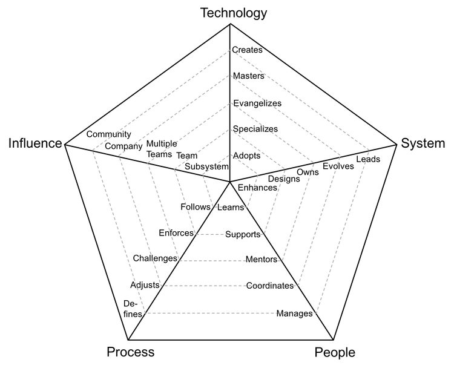

# 20년 말 ~ 21년 초의 불안감
2020년은 내 커리어에서 처음으로 1년을 꽉 채워서 열심히 일을 한 첫 해였다. 되돌아보니 뭔가 앞에 주어진 일들을 열심히 치워왔지만, 어떤 정해진 기준을 가지고 열심히 한 것 보다는 **내가 막연하게 생각한 기준**(당장 회사에서 급한 일)으로 일을 열심히 하려 했던 것 같다(하지만 보상은 당연히 잘 받으면 좋겠다고 생각한다 ㅋㅋ). 기준을 어느정도 잡고 일을 한다면 일도 성공적으로 해내는 것 뿐만 아니라 내 커리어도 더 잘 챙길 수 있을 거라 생각한다.

행동 기준이 없어서 그랬는지, 11월 초까지 열심히 달린 뒤에는 뭘 어떤식으로 열심히 해야할 지 잘 기준이 안서서(재택근무도 있었지만) 그 전만큼 몰입하지는 못했던 것 같다. 그 전에는 당장 눈앞에 해야할 일과 일정이 있으니 달려왔지만, 오히려 일정도 없고 정해진 급한 일이 없으니 갈 길을 잃은 상태였고, 마음은 뭔가를 해야할 것 같은데 실제로 뭔가 잘 되지는 않으니 불안하기도 했던 것 같다.

내가 어느 방향으로 어떻게 가야할지에 대한 고민과 함께, 어떤 기준으로 능력치를 쌓아야 할지에 대한 고민을 정리해보고자 한다. Engineering Ladder 프레임워크를 통해 내 상태를 진단하고 각 부문별로 어떤 노력을 해야할지를 정리해보았다.

(다음에는 [Dreyfus model](https://en.wikipedia.org/wiki/Dreyfus_model_of_skill_acquisition)을 사용해서 분석해보자.)

# Engineering ladder

## 5가지 능력치와 4가지 직군
평가 시즌이 다가오면서, SWE로서 트랙별로 커리어 사다리를 정리해놓은 [Engineering Ladders](http://www.engineeringladders.com/)라는 사이트가 팀 내에 공유되었었다. 해당 프레임워크에서는 크게 다섯가지로 능력치를 구분하고 있다. 

_* Source : www.engineeringladders.com_

위 페이지에서 설명하는 각 능력들의 정의는 다음과 같다.
* **Technology**: 기술 스택과 도구들에 대한 지식
* **System**: 시스템들에 대한 오너십의 정도
* **People**: 팀 사이 관계
* **Process**: 개발 프로세스에 대한 관여도
* **Influence**: 각 위치에서 영향력의 범위, 이는 나머지 네가지 능력과 독립적이며,  나머지 네가지 능력에 모두 영향을 준다.

여기서는 네 가지의 직군(career ladder)을 위 다섯 가지의 능력으로 구분한다. 그리고 각 능력의 숙련도에 따라 레벨을 구분한다. 

* **Developer**: 프로그래머, SWE, 기술적 전문성
* **Tech Lead**: 시스템 오너, 개발과 아키텍쳐 지식, 프로덕션 지원 사이에 밸런스를 필요로 한다
* **Technical Program Manager**: 여러 팀들이 계획을 달성할 수 있도록 조정하고 이끄는 데에 책임이 있음
* **Engineering Manager**: 개발 팀이 지속적으로 결과를 내고, 커리어적으로 성장하며, 행복할 수 있도록 매니징 하는 직군

(작년 평가 때 팀장님이 '다양한 경험을 해보는게 중요하다'고 했는데, 그 말이 맞는것 같다. 이전까지는 막연하게 '개발자'로 성공하는것이 목표였지만, 이렇게 세부적으로 써놓고 보면 결국 어떤 길을 가야할지 아직은 잘 모르겠다.)

다양한 경험 속에서 내가 잘하고 잘 맞는 방향으로 가는게 중요하지 않을까 하는 생각도 든다. 내 성격 상 결국에는 '원하는 것'을 하기보다는 '잘하는 것'을 하는게 더 행복하고 편안할 것 같다(ㅋㅋㅋ)

## 자가 평가

나는 어느정도 단계인지 5가지 능력치 별로 자가평가를 해보자.

### Technology
우선 **기술** 항목은 사용하는 기술 스택 및 도구에 대한 전문성을 평가한다. 우리 팀에서 주로 사용하는 스택은 다음과 같다.

#### 프로덕트 스택
* C# 7.1 (dotnet core 3.1)
* AWS DynamoDB
* AWS SQS
* AWS Firehose & Kinesis
* Kibana, Elastic
* Redis
* ETCD
* Kubernetes / Docker
* Typescript
* Vue
* Angular

#### 내부 툴 스택
* Nodejs
* AWS EC2
* Typescript & Javascript
* Vue
* Nextjs
* Python & Django
* Slack app

기술 파트의 단계는 다음과 같이 나눠진다.
* 1단계 **Adopts**: 팀에서 사용하는 툴과 기술을 적극적으로 배우고 적용하는 단계
* 2단계 **Specializes**: 한가지 이상의 기술에 대해 다른 사람들이 물어보려고 찾는 사람이면서 새로운 기술을 주도해서 배우는 사람 
* 3단계 **Evangelizes**: 연구하고 새로운 Proof Of Concept를 만들어가고, 신기술을 팀에 도입하는 사람
* 4단계 **Masters**: 시스템 모든 기술 스택에 대해 아주 깊은 지식을 가진 사람
* 5단계 **Creates**: 내부 또는 외부 팀에서 폭넓게 사용되는 새로운 기술을 설계하고 만들어내는 사람

내 단계는 1단계와 2단계 그 사이 어딘가 인 것 같다. '물어보려고 찾는다'의 기준이 팀의 시니어를 포함한 모든 팀원이라면 위 기술중에는 없는 것 같고, 다만 우리 팀 주니어 사이에서는 Slack app api와 Python django 정도는 가끔 나에게 물어보셨던 것 같다. 
~~써놓고 보니 너무 하찮게 느껴진다 ㅜㅜ 우리 팀원들이 너무 다 잘하시는 분들이라고 생각해보자..~~

#### 결론 - Adopts (1단계)
#### 목표 - 위 스택 중 1개라도 더 깊게 공부해보자. 다른 사람이 그거 관련해서는 나에게 물어볼 정도로. -> 2단계

---

### System
System 각 단계의 기준을 먼저 정리해보자면 다음과 같다.

* 1단계 **Enhances**: 기존 시스템을 개선하거나 확장하기 위해 기능이나 버그 fix를 성공적으로 올리는 단계
* 2단계 **Designs**: 시스템의 기술적 부채를 감소시키면서 중간에서 큰 사이즈의 피쳐를 설계 및 구현하는 단계
* 3단계 **Owns**: 시스템의 모니터링과 프로덕션 운영을 own하고, SLA를 알고있음
* 4단계 **Evolves**: 아키텍쳐가 미래의 요구사항을 맞출 수 있도록 진화시키고, SLA를 정의함
* 5단계 **Leads**: 시스템의 기술적 완성도를 만들어내고 장애 대응 계획을 만듬

나는 신규 서비스를 만들기는 했지만 기술적 부채를 감소시키지는 못했다(1단계). 올해에는 해당 신규 서비스가 기존의 기술적 부채를 해소할 수 있도록 작업할 예정이다. 따라서 이 또한 1단계와 2단계 사이에 있지만 아직은 1단계인 것 같다.

사실 신규 서비스를 만들면서 일정에 밀려서 기존 서비스 로직을 그래도 가져다 쓴 게 너무 마음이 아픈데, 그 이후에 12월 즈음부터 시간이 조금 여유가 있었음에도 나서서 고치지 못한것이 많이 아쉽다. 그러한 리팩토링 및 기술 부채 제거에 대한 일정관리법도 꼭 고민해 봐야겠다.

올해는 꼭 해당 서비스를 기술부채를 해결한 상태로 6월 경에 내보내는 것을 목표로 열심히 달려보자. 그래도 큰 마일스톤 4개중에 2개는 1월에 어느정도 해결해놔서 각이 보이긴 한다 ㅎㅎ

#### 결론 - Enhances (1단계)
#### 목표 - 신규 서비스 기술부채 완벽히 해결해서 6월 경 런칭하기 -> 2단계

---

### People
People 각 단계를 또 먼저 정리해보자.

* 1단계 **Learns**: 다른 사람으로부터 빠르게 배우고 필요할 때에 지속적으로 나선다
* 2단계 **Supports**: 선제적으로 다른 팀원을 지원하고 그들이 성공적으로 일을 진행할 수 있도록 돕는다
* 3단계 **Mentors**: 다른 사람들이 커리어 성장을 가속할 수 있도록 멘토링 하고 참여할 수 있도록 격려
* 4단계 **Coordinates**: 팀 멤버틀에게 효과적인 피드백과 토론 중재를 통해 팀원들을 이끈다
* 5단계 **Manages**: 팀원들의 커리어, 기대, 성과, 행복의 정도를 매니징한다

다른 팀원을 도와준 적은 있지만, 어떤 문제가 생길 것이라고 미리 알려주거나 지원해준 경험은 거의 없는 것 같다. 얼마전에 Sendbird 대표 김동신님의 [유튜브 존잡생각](https://www.youtube.com/channel/UCSqtYUDXgy7RmpMazTMFSHQ)에서 proactive한게 얼마나 중요한지에 대해서 본 것 같은데, 그 인사이트와 함께 proactive 해지는 연습을 하는 1년이 되어야겠다.

#### 결론 - Learns (1단계)
#### 목표 - proactive 해지자

---

### Process
Process의 단계는 다음과 같다.

* 1단계 **Follows**: 팀의 프로세스를 따르고 지속적으로 피쳐를 프로덕션에 배포한다
* 2단계 **Enforces**: 팀의 프로세스를 강제하고, 모두가 장단점을 알도록 한다
* 3단계 **Challenges**: 팀 프로세스에 도전, 개선점을 찾는다
* 4단계 **Adjusts**: 팀의 프로세스를 조정하고, 변화하는 프로세스에 대해 팀을 안내하고 피드백을 듣는다
* 5단계 **Defines**: 팀의 성숙도에 알맞은 프로세스를 정의하고, 빠른 속도와 규율을 균형있게 조정한다

팀에게 정해진 프로세스를 강제하긴 했다. 슬랙에 MR을 무조건 받도록 하는 MR Tracker workflow를 만들고, 팀의 피드백을 받아 지속적으로 개선하며 사용할 수 있도록 장려했다. 페어 프로그래밍이나 TDD의 경우도 열심히 따르고 또 스프린트 마스터일 때에는 강제하기도 했다. 문서화는 이쁘게 하려고 하지만 다른 사람들에게 이쁘게 해달라고 요청하지는 못했던 것 같다. 

하지만 항상 내가 주도적으로 생각하고 강제하고 제안하고 하지는 못했던 것 같다. 100점 중 80점 정도? 2단계에 가깝지만 아직은 1단계인듯 하다. 

나부터도 문서화의 필요성을 잘 알고있으나 잘 하지 못하는 입장이므로, 올해는 '문서화를 강제한다'에 초점을 맞춰봐야겠다. 문서화를 세부적으로 하는 정도에 따라 당연히 시간 소모가 달라지므로 두단계 정도로 나누어서 작업하는 등 '장단점을 인지한' 작업을 추진해보면 좋을 것 같다. (Template을 두가지로 만들어 보자 - 간단한 빠른 기록용 버전과 상세 기록용 버전)

별개로 조직 전체에서 사용하는 프로세스를 20년 중순부터 관리해왔는데, 비효율적인걸 느끼고 힘들어했고 개선하려고 시도해봤지만 개선하지 못했다. 결국 올해 초에 시니어분의 도움을 받아서 개선했다 (그리고 시니어분이 개입하자 굉장히 빠른 속도로 해결할 수 있었다..!). 그 때 배운 점을 기록해놓아야 겠다.

#### 결론 - Follows (1단계)
#### 목표 - '문서화'를 단계를 나누어 template화 하고, Enforce해보자

---

### Influence
Influence의 단계는 다음과 같다.

* 1단계 **Subsystem**: 하나 또는 그 이상의 서브시스템에 영향을 끼침
* 2단계 **Team**: 팀 전체에 영향을 끼침, 그 일부만이 아니라
* 3단계 **Multiple Teams**: 나의 팀 뿐만 아니라 다른 팀에도 영향을 끼침
* 4단계 **Company**: 조직 전체에 영향을 끼침
* 5단계 **Community**: 커뮤니티에 영향을 끼침

사실 이 Influence 능력은 크게 와닿지는 않는다. 다만 처음 소개에서 말했듯이, 나머지 네가지 분야에 각각 influence가 적용될 수 있을 것 같다. 

* **Technology** - 당연히 팀 내부(Subsystem)에서만 영향을 끼치고 있다..ㅎㅎ
* **System** - 마찬가지.. 우리 팀이 담당하는 서비스가 대략 5~6개 되는데, 내가 찐 영향을 미치는 곳은 한 개 정도이다..
* **People** - 마찬가지로 팀 내부에서만 영향을 끼친다
* **Process** - 팀 외부는 말할것도 없고, 전체에 큰 영향을 끼치지 못했다

결과적으로 모두 1단계 Subsystem 내부에서만 영향을 끼칠 수 있었다. 

Influence는 지금 느끼기로는 나머지 각 분야에서 단계가 올라갈 때에 자연스럽게 따라오는 것 아닐까 하는 생각이다. 내가 억지로 영향력을 높이려 해도 받쳐줄 것이 없으면 아무도 따라오지 않을 것이다. 이 부문에서는 따로 목표를 잡지 않겠다.

#### 결과 - Subsystem(1단계)
#### 목표 - X

---

# 결과와 21년 중점 노력 키워드

|분야|20년 단계|21년 목표 키워드|
|---|---|---|
|Technology|Adopts(1단계)|stack 하나만 전문화|
|System|Enhances(1단계)|기술부채 해결|
|People|Learns(1단계)|Proactive!|
|Process|Follows(1단계)|문서화 enforcement|
|Influence|Subsystem(1단계)||

위 단계에 해당하는 Engineering Ladder의 직급은 D1 (Developer Level 1)이다. 다음 단계인 D2에는 System, People, Process에서 한 단계씩 증가한다. 21년 말에는 최소한 그정도의 능력은 가질 수 있도록 해보자.

## 잡생각

2년차인데, 이런 분석을 해볼때면 아직도 한참 모자란 것 같다. 개발자 평균 연차별 어느정도 성장 곡선(?) 같은게 있어서 비교해볼 수 있으면 좋을 것 같다. (온라인 심리 테스트마냥 년차 적고 위 각 항목별로 질문지를 만들어서 입력하면 자동으로 단계 분석해주는 사이트를 만들어도 ~~편할 것~~ 재미있을 것 같다. 전체 통계도 있어서 내가 어디쯤 와있는지도 알려주고)