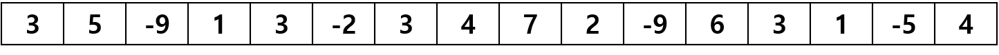
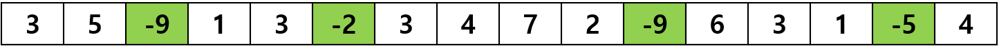
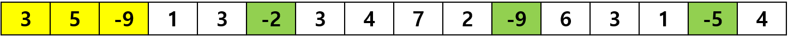
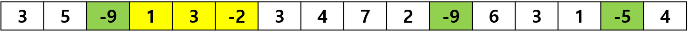
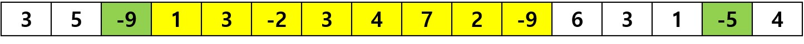
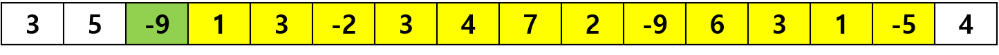
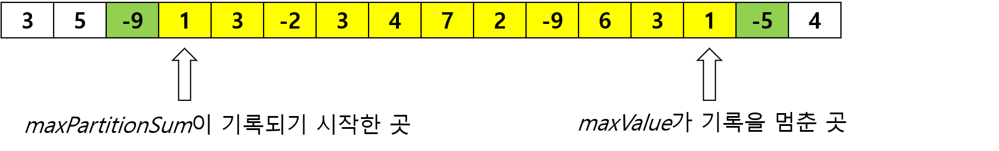

> unsorted int array가 있을 때, 이 array의 subarray 중 sum이 가장 큰 subarray를 구하는 방법, Time: O(N), Space: O(1)

## My first approach

'뭔가 DP를 사용하면 되지 않을까?' 해서 array를 순회하면서 가장 최고의 값을 계속 업데이트 하도록 했다. 

- 초기화


- Subproblem


<span style="color:#aaaaaa; text">~~_수식이 조금 이상하지만 내가 표현할 수 있는 최선인듯..?_~~</span>

```java
// 이런느낌
for (int left = 1; left < array.length; left++) {
    for (int right = left; right < array.length; right++) {
        var localSum = 0;
        for (int i = left; i <= right; i++) {
            localSum += array[i];
        }
        dp[right] = Math.max(dp[right-1], Math.max(dp[right], localSum));
    }
}
```

문제를 풀긴 했는데, 이게 Time complexity가 O(N^3)이라 너무 노답이었다. (Space는 O(N)만 쓰긴 했지만.)


## So.. What is Kadane's algorithm?

```java
// java
public static int kadanesAlgorithm(int[] array) {
    int maxValue = array[0];
    int maxPartitionSum = array[0];
    
    for (int i = 1; i < array.length; i++) {
        maxPartitionSum = Math.max(array[i], maxPartitionSum + array[i]);
        maxValue = Math.max(maxValue, maxPartitionSum);
    }
    return maxValue;
}
```

1. **maxPartitionSum** - 중요한건 음수가 나오는 곳인데, 이 음수를 포용해서 가져갈 것이냐 아니면 해당 수의 절댓값이 너무 커서 끊고 그 다음 수부터 새로 subarray를 만들것이냐 판단을 해야한다.

    판단하는 방법은, _해당 수까지의 최고의 합 + 다음 수_ 와 _다음 수_ 중 큰 것을 다음 누적 합계로 사용한다.

    - 만약 _해당 수까지의 최고의 합 + 다음 수_ 가 더 크면, 당연히 포함 하는게 더 이득,
    - 만약 다음수 자체가 더 크다면 그 음수의 영향이 너무 커서 전체 합을 잡아먹는 것이므로 버리는 게 낫다.

2. **maxValue** - 위에서 계산된 maxPartitionSum이 결국 그 index에서 최고의 subarray sum 값을 나타내므로, maxPartitionSum 값으로 계속 max를 업데이트 한다.


### Example

다음의 array가 있다고 해보자.
([AlgoExpert](https://www.algoexpert.io/) 문제의 Sample 값이다.)



&nbsp;

쪼갤 가능성이 있는 점은 바로 음수인 지점이다.



&nbsp;

#### 처음 -9에서 쪼갤지 말지를 결정해보자

&nbsp;



&nbsp;

-9까지의 _maxPartitionSum_ 를 구해왔다면 3 + 5 - 9 = -1일 것이다.
따라서 다음 _maxPartitionSum_ 는 -1 + 1 = 0 과 1 자체 중 큰 수인 1이 된다.

이 의미는, 이제 _maxPartitionSum_ 에 -9까지의 수가 포함되지 않았으므로, 이후 _maxPartitionSum_ 계산 시 1부터 새로운 sub array를 사용하는 것이다.

또한, -9 이전의 최고의 sub array 합인 8이 _maxValue_ 에 저장되어 있을 것이다.

&nbsp;

#### 다음으로 -2에서 쪼갤지 말 지 생각해보자

&nbsp;



&nbsp;

-2 까지의 _maxPartitionSum_ 을 구하면 1 + 3 + -2 = 2 이다. 
따라서 다음 _maxPartitionSum_ 는 2 + 3 = 5와 3 중 큰 수인 5가 된다.

이 의미는, -2로 인해 작아지는 영향이 더 적기 때문에 새로운 sub array로 분리할 필요가 없음을 의미한다.

따라서 이 이후로 계속 _maxPartitionSum_ 은 -9를 만나기 전까지는 또 증가할 것이다.

#### 또다시 만난 -9에서는 어떻게 될까?

&nbsp;



&nbsp;

여기서도 -9 까지의 _maxPartitionSum_ 을 구하면 1 + 3 -2 + 3 + 4 + 7 + 2 - 9 = 9 이다. 따라서 다음 _maxPartitionSum_ 은 9 + 6 = 15 와 6 중 큰 수인 15가 된다.

이 의미는, 위 -2에서처럼 -9로 인해 작아지는 것 보다 sub array를 유지하는게 합이 더 큰 상황을 의미한다.

#### 마지막, -5에서는?

&nbsp;



&nbsp;

똑같이 -5 까지의 _maxPartitionSum_을 구하면 15 + 3 + 1 -5 = 14, 다음 값은 14 + 4 와 4 중 큰 값인 14로 넘어간다. 

이 뒤에도 계속 수가 나온다면 sub array가 끊어지지 않고 진행되는 것을 의미하지만, **실제로 _maxValue_ 는 -5 이전인 1까지가 최고의 값이었으므로 1까지의 합이 기록된다.**

이는, **sub array 합게의 시작점은 _maxPartitionSum_ 이 구분해주고, 합계의 끝 지점은 _maxValue_ 가 구분해주는 의미** 로 보인다.

따라서 결과는 다음 sub array의 합계인 19가 될 것이다.



&nbsp;

Time Complexity는 1회만 iterate 했으므로 O(N), Space Complexity는 _maxPartitionSum_ 및 _maxValue_ 의 두 상수만 사용했으므로 O(1) 이다.

# 잡설

이 이전까지 마냥 DP 문제만 풀다 보니 너무 DP 생각만 해서 끔찍한 풀이를 생각했다. 어떤 상황에 DP를 쓰고, 어떤 상황에 DP를 사용하지 않을지에 대해 기준을 명확히 알아보고 기억해야겠다.

다음 글감으로 작성해 봐야겠다.
